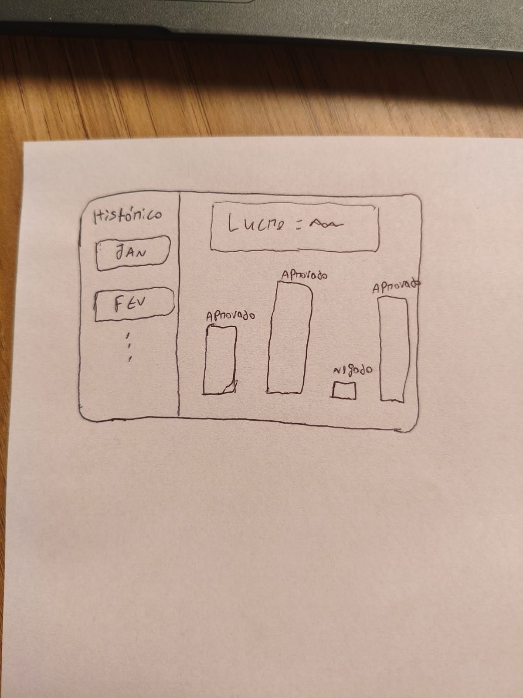
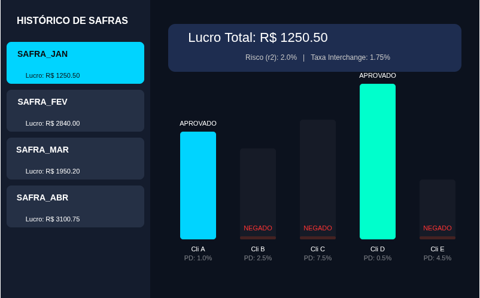

## Ponderada de UX: Visualização do Histórico dos Limites Aprovados 

**Nome:** Francisco de Araujo Ferreira Filho

## 1. Introdução à Proposta
A proposta consiste em uma ferramenta de análise retrospectiva, projetada para permitir uma consulta rápida a concessões de crédito passadas e seus respectivos resultados. O objetivo principal é facilitar a identificação de padrões e a necessidade de ajustes nas políticas de disponibilidade de crédito.

O sistema atua como um protótipo de visualização para o front-end, fundamentado nos resultados da implementação do algoritmo Simplex. Ele demonstra como diferentes políticas de risco ($r2$) e taxas de interchange impactaram a carteira de clientes em períodos anteriores (Safras). A intenção é que o usuário compreenda a lógica de aprovação ou negação do algoritmo ao comparar cenários de sucesso e cautela de forma visual e intuitiva.

---

## 2. Rascunhos Iniciais
O design foi focado em três pilares fundamentais:
* **Dados Importantes:** Centralização de informações essenciais para a tomada de decisão, evitando a sobrecarga cognitiva.
* **Navegação Lateral:** Organização cronológica das safras para identificação rápida de cenários.
* **Cores:** Uso de cores contrastantes para status de aprovação.
* **Ux facil:** Visuzalização simples, muito intuitiva e facil interpretação.

---

## 3. Registro do Resultado Obtido
O protótipo final, desenvolvido em **p5.js**:

* **Interatividade de Seleção:** Ao clicar em qualquer card da barra lateral, o gráfico à direita é reconstruído com os parâmetros daquela safra específica.
* **Feedback de Performance:** O lucro total e os parâmetros de risco são destacados no topo da tela, servindo como a conclusão da análise do cenário selecionado.
* **Visualização de Capacidade:** As barras de fundo (opacas) mostram o limite potencial do cliente (Capacidade), enquanto as barras sólidas mostram o que o algoritmo realmente liberou, evidenciando as restrições impostas pelo Simplex.
* **Animação de Transição:** Implementação de interpolação (`lerp`) para que a mudança entre safras seja percebida como um processo de ajuste dinâmico.
* **Limitações:** Esta visualização é melhor para se ter uma noção de como poderia ser um possível painel com o histórico. Como foi desenvolvida em pouco tempo, é limitada e não muito bonito. Se, no futuro, for implementado algo parecido, será muito mais bonito e com uma UX melhor.👍

---

### Comparação Visual

| Obra Original | Recriação com p5.js |
| :---: | :---: |
|  |  |

---

**Importante:** Devido ao pouco tempo para desenvolver a visualização, acabei utilizando Inteligência Artificial mais do que gostaria para concluir a ponderada.😔
